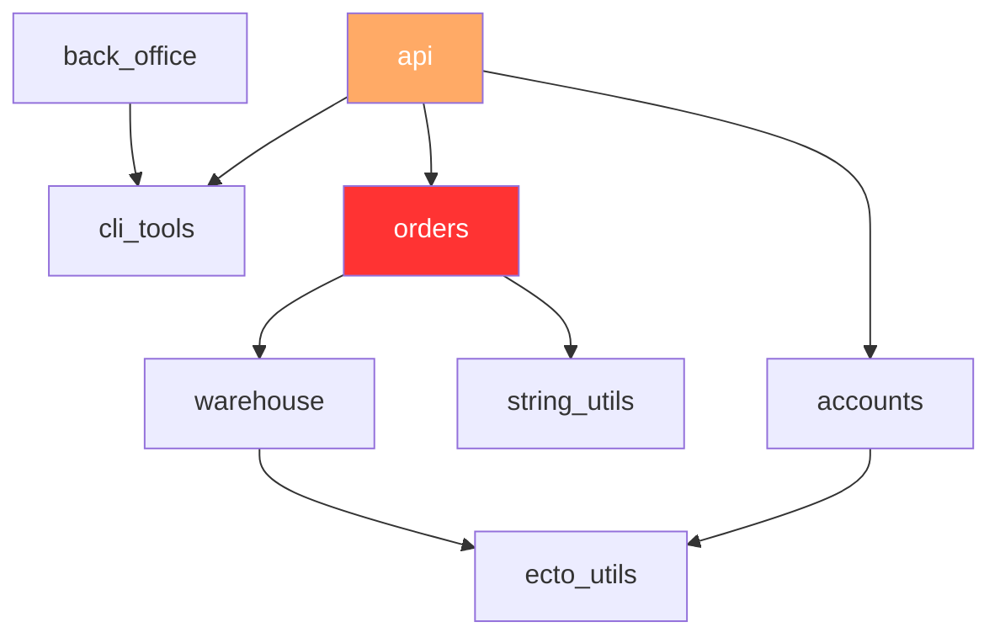

# Workspace

`Workspace` provides a set of tools for working with **elixir monorepos**.

> #### What is a monorepo? {: .neutral}
>
> **A monorepo is a single repository containing multiple distinct projects.**
>
> In a monorepo setup, all related application, libraries, and tools, are housed
> together, allowing developers to manage and version control them collectively.

Monorepos on big codebases offer several potential benefits:

  * **Code Sharing** - Developers can easily share code and components across
  projects within the same repository, promoting code reuse and reducing duplication.
  * **Consistent Versioning** - All components in the monorepo can share the same
  versioning scheme, ensuring consistency and compatibility.
  * **Simplified Dependency Management** - Since all dependencies are managed
  within a single repository, dependency management can be more straightforward
  compared to managing dependencies across multiple repositories.
  * **Streamlined Build and Continuous Integration** - With all code in one place,
  build processes and continuous integration (CI) pipelines can be more efficient,
  as changes to any part of the codebase can trigger only the CI steps **affected
  by this change**. Additionally any change to any component is immediately tested
  across all packages using the modified component.
  * **Improved Collaboration** - Developers can more easily collaborate on different
  parts of the system since all code is accessible within the same repository.
  * **Modular Design and Architectural Consistency** - With all related projects and
  components housed together, developers are incentivized to create modular, reusable
  code that adheres to consistent architectural patterns. This promotes better
  design practices and helps maintain a cohesive architecture across the entire
  codebase.

## Overview

`Workspace` provides a set of tools for working with multiple projects under
the same git repo. Using path dependencies between the projects and the
provided tools you can effectively work on massive codebases properly
split into reusable packages.

### Core features

The core features of `Workspace` are:

  * **Non intrusive** - zero dependencies for your elixir projects.
  * **Run tasks efficiently** - includes a `mix workspace.run` command for
  orchestrating where each task will be executed; test only affected projects
  by a change, format only modified projects, or partition your executions,
  reducing significantly CI times.
  * **Enforced boundaries** - tag your projects and enforce boundaries
  between projects, facilitating architectural consistency.
  * **Consistency Checks** - includes a `mix workspace.check` command
  for linting your workspace; ensure that all projects have the same versions
  of external dependencies, or that all projects have valid maintainers.
  * **Arbitrary folder structure** - you can create your projects wherever you
  wish under the workspace root, no assumptions are made.

### The workspace folder structure

A workspace is a normal `Mix.Project` with some tweaks:

  * No actual code is expected, so `:elixirc_paths` is set to `[]`.
  * It must have a `:workspace` project option configured with a `:type` set
  to `:workspace`.
  * You can have as many mix projects as you wish in any folder
  structure under the root.
  * You must use **path dependencies between workspace projects** similarly
  to umbrellas.

## Creating a workspace

The easiest way to create a workspace, is to use the `workspace_new` installer.
Assuming you have elixir installed, install the archive by running:

```bash
$ mix archive.install hex workspace_new
```

Now you can generate your workspace by running:

```bash
$ mix workspace.new my_workspace
```

This will scaffold an empty workspace project under `$PWD/my_workspace`. You can
now start adding mix projects as usual under this root folder.

## The workspace graph

The central concept of the `Workspace` is the workspace graph. This is a directed
acyclic graph where each vertex is a workspace project and each edge a dependency
between two workspace projects.

You can view the graph of your workspace with the `mix workspace.graph` command:

```bash
$ mix workspace.graph --show-status
:api ●
├── :accounts ✔
│   └── :ecto_utils ✔
├── :cli_tools ✔
└── :orders ✚
    ├── :string_utils ✔
    └── :warehouse ✔
        └── :ecto_utils ✔
:back_office ✔
└── :cli_tools ✔
```

> #### Project's status {: .info}
>
> Notice the `--show-status` flag above. `Workspace` detects the changes on your
> git repository and determined which projects are `modified` and which ones are
> `affected` by the changes.
>
> This way you can limit the execution of a task to the relevant projects.
>
> See also `mix workspace.status`.

You can also output the graph as a `mermaid` chart:



## Running tasks on projects

Monorepos can have hundreds of projects, so being able to run actions against
all (or some) of them is a key feature of `Workspace`.

`mix workspace.run` allows you to:

  * Run a task against all or a subset of projects.
  * Run tasks only on projects based on their status and workspace graph topology.
  * Filter projects based on tags.
  * Partitioning runs for parallelizing CI steps.

For example:

```bash
# Run mix deps.get on all workspace projects
$ mix workspace.run -t deps.get

# Run mix docs only on cli_tools
$ mix workspace.run -t docs -p cli_tools

# Run mix test on all affected projects
$ mix workspace.run -t test --affected

# Run mix format on all modified projects
$ mix workspace.run -t format --modified

# Run mix compile only on top level projects
$ mix workspace.run -t compile --only-roots -- --warnings-as-errors
```

Check the `mix workspace.run` docs for more details.

## Workspace checks

When your mono-repo grows it is becoming more tedious to keep track with
all projects and ensure that the same standards apply to all projects. For
example you may wish to have common dependencies defined across all your
projects, or specific conventions for the various artifacts output folders.

All checks implement the `Workspace.Check` behaviour and can be configured
in your `.workspace.exs` file. `Workspace` comes with some default checks
that among other, allow you to:

  * Ensure that [specific dependencies are set](`Workspace.Checks.EnsureDependencies`)
  on all projects, e.g. `ex_doc`.
  * Ensure that external [dependencies versions match the expected ones](`Workspace.Checks.DependenciesVersion`).
  * Verify that [no forbidden dependencies are defined](`Workspace.Checks.ForbiddenDeps`).
  * [Validate arbitrarily](`Workspace.Checks.ValidateProject`) the projects' config objects.
  * [Enforce boundaries](`Workspace.Checks.EnforceBoundaries`) between workspace projects.

You could also implement your own checks, incorporating any custom validation
logic you may wish.

You can run the checks against your workspace through the `mix workspace.check`
command:

```bash
$ mix workspace.check
running 4 workspace checks on the workspace

==> C000 validate workspace relative path dependencies
==> C001 all projects must have a description set
ERROR :accounts - no :description set packages/accounts
==> C002 forbidden dependencies are not used
ERROR :ecto_utils - the following forbidden dependencies were detected: [:poison] packages/ecto_utils
==> C003 strict external dependencies
ERROR :string_utils - version mismatches for the following dependencies: [:ex_doc]
    → :ex_doc expected "== 0.28.3" "== 0.30.0" packages/string_utils
```

## Installation

If you want to manually create the workspace root project and not you the
`:workspace_new` scaffolding tool, then you need to add `workspace` as a
top level dependency:

```elixir
def deps do
  [
    {:workspace, "~> 0.1.0"}
  ]
end
```

and also indicate that the current project is a `workspace`:

```elixir
def project do
[
  workspace: [
    type: :workspace,
    # arbitrary options can be set there
  ],
  # rest Mix.Project settings
]
end
```

## License

Copyright (c) 2023 Panagiotis Nezis, Sportradar

Workspace is released under the MIT License. See the [LICENSE](LICENSE) file for more
details.
